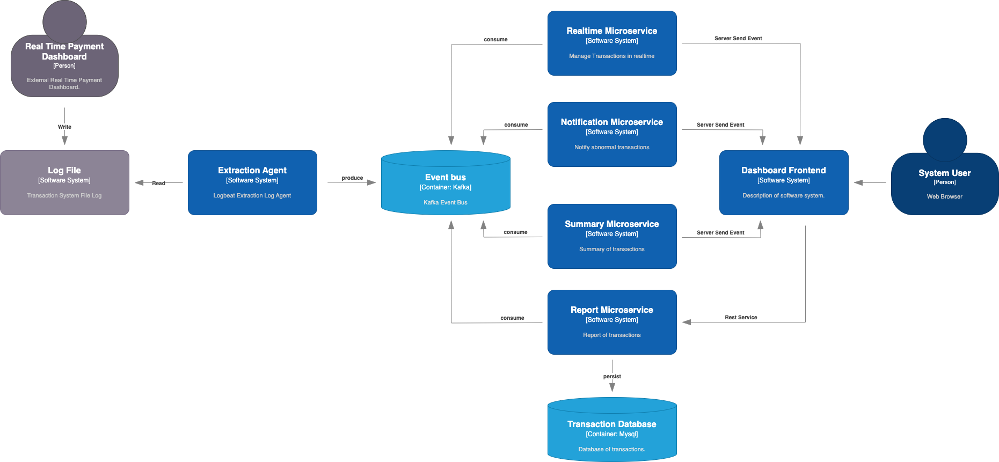
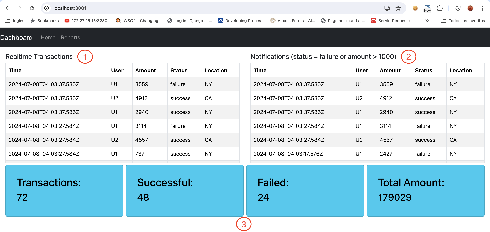
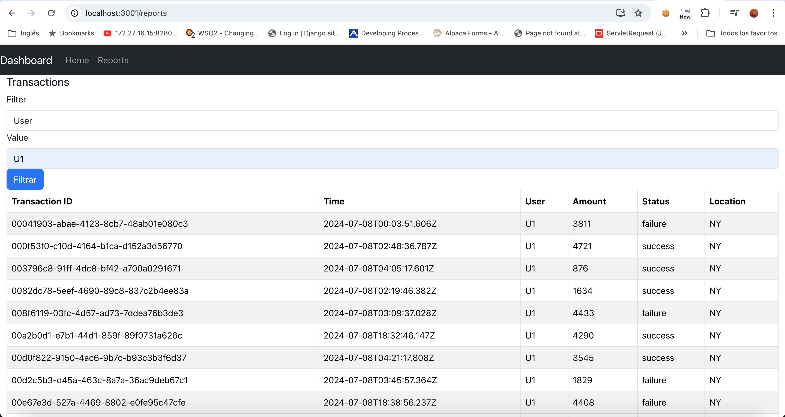

## Arquitectura




Para la arquitectura se plantea la configuración de un agente de extracción de logs, el desarrollo de 4 microservicios para el backend y el desarrollo de 1 frontend de tipo Single Page Application.  Los logs seran extraidos y cargados a un event bus para que sean consumidos por los diferentes microservicios y para la visualización en el front. Los microservicios expondran endpoints REST utilizando Server Send Events para que el cliente pueda visualizarlos en tiempo real.

A continuación una descripción de cada uno de los componentes de la arquitectura:

### Real Time Payment Dashboard
Software externo desarrollado en NodeJS encargado de la generación de logs de transacciones.

### Log File
Archivo plano generado por el Real Time Payment Dashboard con los logs de transacciones.

### Extraction Agent
Implementado con el software libre [filebeat](https://www.elastic.co/es/beats/filebeat). Este agente se encarga de extraer los logs del archivo generado por la aplicación Real Time Dashboard y envia cada linea del log al event bus.
En el archivo [filebeat-dashboard.yaml](https://github.com/jcastellanos/realtime-processing/blob/main/filebeat-dashboard.yaml) se encuentra la configuración de filebeat para extraer los logs y cargarlos a Kafka, para ejecutarlo se debe descargar filebeat y ejecutar el siguiente comando:

```
./filebeat -e -c filebeat-dashboard.yaml
```

### Event bus
Implementado con el software libre [Kafka](https://kafka.apache.org/). Todos los mensajes seran producido por el "Extraction Agent" a un topic de Kafka llamado "transactions". Los microservicios consumiran de este topic. Cada microservicio utilizara un Group ID diferente para que cada microservicio consumas todos los eventos que llegan a este topic.

### Realtime Microservice
Microservicio que consume los eventos del kafka y expone el endpoint /realtime/sse para que los clientes puedan obtener en tiempo real todas las transacciones. Con el siguiente comando curl se pueden consumir por consola en tiempo real los eventos a través de este servicio:
```
curl — location — request GET 'localhost:8080/realtime/sse' — header 'Content-Type: text/event-stream;charset=UTF-8' — header 'Accept: text/event-stream;charset=UTF-8'
```
Este microservicio fue desarrollado con Spring Boot + maven. Para el endpoint en tiempo real se utilizaron Server Side Events. Para la implementación de server side events se utilizó webflux y una libreria de kafka de project reactor. Al utilizar estas librerias reactivas se evita el problema de Thread per request que se podria generar al utilizar Server Side Events.

Código: https://github.com/jcastellanos/realtime-processing/tree/main/backend/transaction-realtime-service

### Notification Microservice
Microservicio que consume los eventos del kafka y expone el endpoint /notification/sse para que los clientes puedan obtener las transacciones en tiempo real que generar algun tipo de alertamiento, por ejemplo transacciones con status = failed o transacciones cuyo amount supera un limite. Con el siguiente comando curl se pueden consumir por consola en tiempo real los eventos a través de este servicio:
```
curl — location — request GET 'localhost:8081/notification/sse' — header 'Content-Type: text/event-stream;charset=UTF-8' — header 'Accept: text/event-stream;charset=UTF-8'
```
Este microservicio fue desarrollado con Spring Boot + maven. Para el endpoint en tiempo real se utilizaron Server Side Events. Para la implementación de server side events se utilizó webflux y una libreria de kafka de project reactor. Al utilizar estas librerias reactivas se evita el problema de Thread per request que se podria generar al utilizar Server Side Events.

Código: https://github.com/jcastellanos/realtime-processing/tree/main/backend/transaction-notification-service

### Summary Microservice
Microservicio que consume los eventos del kafka y expone el endpoint /summary/sse para obtener estadisticas de las transacciones en tiempo real. Con el siguiente comando curl se pueden consumir por consola en tiempo real los eventos a través de este servicio:
```
curl — location — request GET 'localhost:8082/summary/sse' — header 'Content-Type: text/event-stream;charset=UTF-8' — header 'Accept: text/event-stream;charset=UTF-8'
```
Este microservicio fue desarrollado con Spring Boot + maven. Para el endpoint en tiempo real se utilizaron Server Side Events. Para la implementación de server side events se utilizó webflux y una libreria de kafka de project reactor. Al utilizar estas librerias reactivas se evita el problema de Thread per request que se podria generar al utilizar Server Side Events.

Código: https://github.com/jcastellanos/realtime-processing/tree/main/backend/transaction-summary-service

### Report Microservice
Microservicio que consume los eventos del kafka, almacena las transacciones en la Transaction Database y expone el endpoint /report/transactions para poder filtrar las transacciones. Con el siguiente comando curl se pueden filtrar las transacciones de un usuario especifico:
```
curl — location — request GET 'localhost:8083/report/transactions?filter=user&value=U1'
```
Este microservicio fue desarrollado con Spring Boot + maven. Se utilizo spring boot web y spring JPA por su facilidad de desarrollo para el endpoint de reportes y la generación de consultas en BD.

Código: https://github.com/jcastellanos/realtime-processing/tree/main/backend/transaction-report-service

### Transaction Database
Base de datos relacional Mysql. En esta base de datos se persisten todas las transacciones para poder filtrarlas, generar reportes y dashboards.
Por motivos de tiempo de entrega, se utilizó una base de datos relacional. La arquitectura productiva deberia utilizar un ElasticSearch para persistir las transacciones y hacer busquedas sobre el elasticsearch. También se puede montar un Kibana para hacer tableros y dashboards sobre este ElasticSearch sin requerir desarrollo.

### Dashboard Frontend
Frontend de tipo SPA desarrollado con React. El consumo de los endpoint en tiempo real se realiza utilizando la función de EventSource de JavaScript para consumir los endpoints utilizando Server Send Events.

Código: https://github.com/jcastellanos/realtime-processing/tree/main/frontend/real-time-dashboard


### Observaciones
- Se utilizó un solo repositorio de código (mono repo) por facilidad para la entrega. Se recomienda utilizar un repositorio por cada componente.
- Por restricciones de tiempo no se alcanzaron a desarrollar pruebas unitarias. Estas deben ser obligatorias en cualquier tipo de desarrollo.
- Por estricciones de tiempo no fue posible dockerizar todos los componentes. Esto se deberia realizar para poder hacer despliegues con docker compose o con kubernetes ya que es una arquitectura de microservicios.
- Pendiente agregar metricas con Datadog, New Relic o Elastic para poder monitorear la solución.

## Demo de funcionalidad
A continuación se muestran capturas del frontend utilizando los microservicios:

### Pantalla principal del dashboard


1. Realtime transactions: en esta sección de la interfaz se despliegan en tiempo real todas las transacciones.
2. Notifications: en esta sección se despliegan en tiempo real solo las transacciones que tienen algun tipo de alerta (status = failure o amount > 1000). Cuando llega una nueva transacción el título de esta sección se resalta automáticamente en rojo.
3. Summary: en esta sección se despliegan en tiempo real las estadisticas por hora. Cada hora se establecen en 0 los valores para totalizar por hora.

### Pantalla de reportes

Esta funcionalidad permite desplegar todas las transacciones del sistema. Se puede filtrar por Usuario, Status o Identificador de la transacción. En caso de no seleccionar algun filtro retorna todas las transacciones.
Esta funcionalidad deberia soportar páginado ya que no es correcto retornar todas las transacciones, pero por motivos de tiempos de entrega no fue posible realizarlo.

### Video
Pendiente subir un video con el demo.